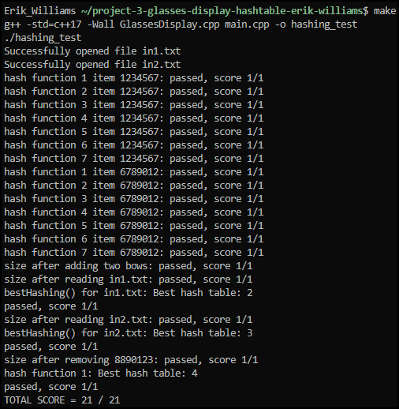

# Project 3 - Balanced Glasses Display

This project focuses on the implementation of an algorithm related to hash tables. There are different hash functions that will produce hash chains of various length when the same dataset is given.

Group members:

Erik Williams

epwilliams@csu.fullerton.edu

## Implementation

- main.cpp: Contains tests to verify the correctness of the function members. This file can be modified to add helpful functions for your own testing. The project will be tested with a similar but different test file during evaluation.

- GlassesDisplay.cpp and GlassesDisplay.hpp: Contain the implementation and declarations of the GlassesDisplay class, including methods for manipulating hash tables and determining the best hash function based on balance.

- in1.txt and in2.txt: Input files containing 18 and 36 types of glasses, respectively, used for testing the hash table implementations.

### Class Methods

- addGlasses(): Inserts a new Glasses object into each of the seven hash tables. Each hash table uses the product number as the key and stores a Glasses object as the value. To be implemented.

- removeGlasses(): Removes a pair of glasses, identified by the product number, from each of the seven hash tables. To be implemented.

- bestHashing(): Calculates the balance for each of the seven hash tables (defined as the difference between the sizes of the largest and smallest buckets) and identifies the hash table with the best balance. This method considers only the first 10 buckets of each hash table. If multiple tables have the same lowest balance factor, it returns the first one. Partial implementation provided.

- readTextfile(): Reads pairs of glasses from a specified text file and calls addGlasses() for each line. Implementation provided.

### Hash Functions

Each of the seven hash functions processes a 7-digit product number and returns a specific digit:

- hashfct1: Returns the first digit.
- hashfct2: Returns the second digit.
- hashfct3: Returns the third digit.
- hashfct4: Returns the fourth digit.
- hashfct5: Returns the fifth digit.
- hashfct6: Returns the sixth digit.
- hashfct7: Returns the seventh digit.

All hash functions are implemented and provided in the source code.

